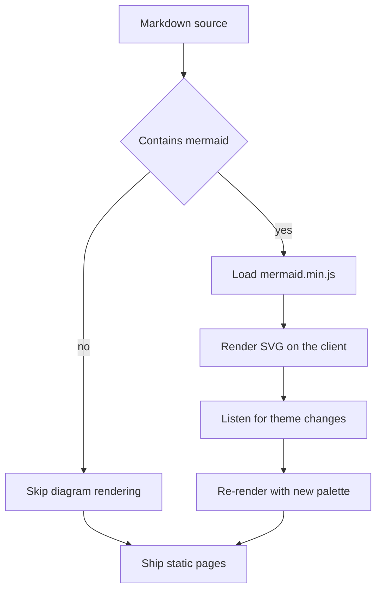
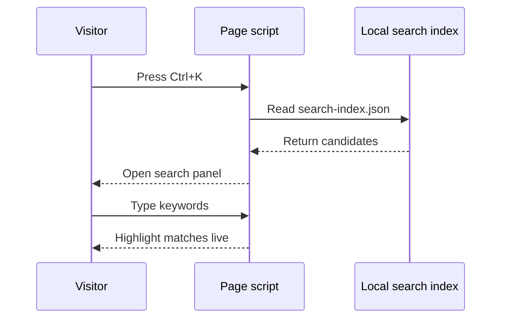
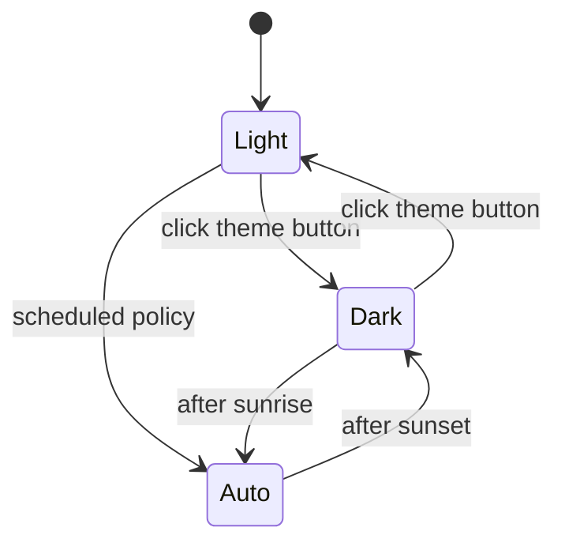
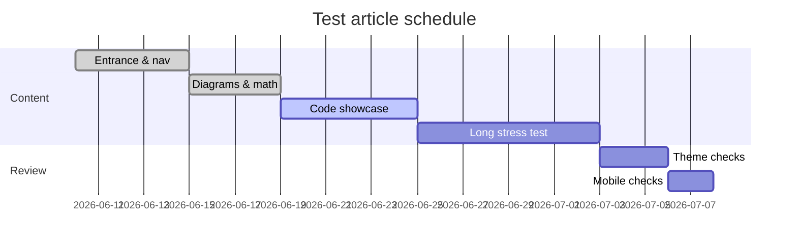
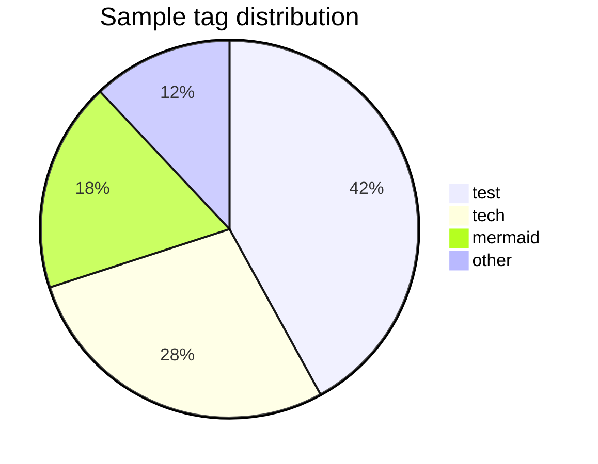

# Diagrams & Math

This page verifies **Mermaid diagrams** and **KaTeX formulas** in both light and dark themes. Toggle the theme button at top right — diagrams should re-render with matching colors.

## Flowchart

## Sequence Diagram

## State Diagram

## Gantt Chart

## Pie Chart

## Inline Formulas

Mass–energy $E = mc^2$; Euler's identity $e^{i\pi} + 1 = 0$; the quadratic formula $x_{1,2} = \frac{-b \pm \sqrt{b^2-4ac}}{2a}$. Delimiter form works too: \(a^2 + b^2 = c^2\).

## Block Formulas

$$
\frac{\partial}{\partial t} \Psi = \frac{i\hbar}{2m} \nabla^2 \Psi
$$

$$
\sum_{n=1}^{\infty} \frac{1}{n^2} = \frac{\pi^2}{6}, \qquad \lim_{x \to 0} \frac{\sin x}{x} = 1
$$

Bracket delimiter:

\[
f(x) = \int_{-\infty}^{\infty} \hat{f}(\xi)\, e^{2\pi i \xi x} \, d\xi
\]

## Matrix Composition

$$
\begin{pmatrix} a & b \\ c & d \end{pmatrix}
\begin{pmatrix} x \\ y \end{pmatrix}
=
\begin{pmatrix} ax + by \\ cx + dy \end{pmatrix}
$$

See [Welcome & Site Map](/en/hello-world/) for how these pages interlink, and [Code Blocks Showcase](/en/code-showcase/) for rendering samples.
