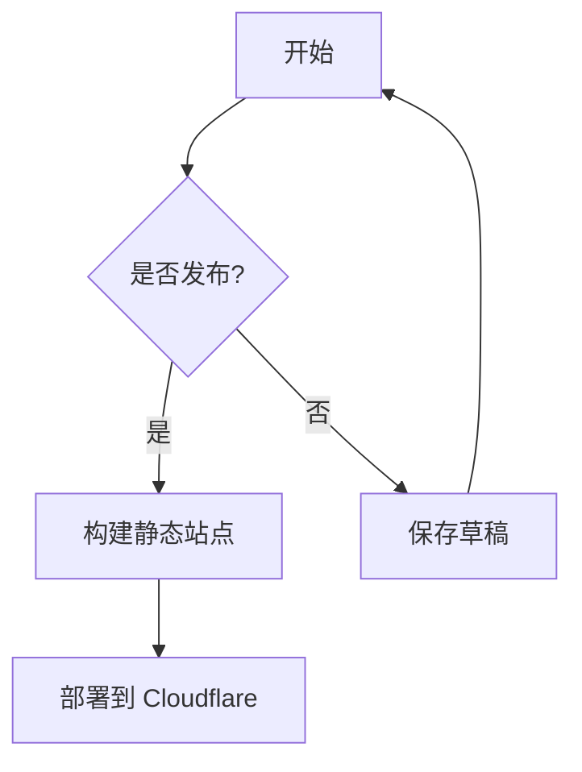
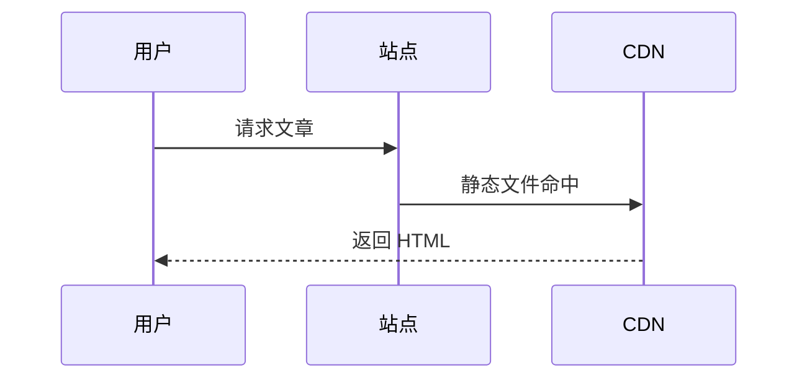

# S-ynapse Full-Feature Testing

This article covers over 80 feature checks of the S-ynapse blog system, serving as a one-stop acceptance test before and after build. It covers basic rendering, security mechanisms, reading experience, content systems, batch features, and UI customization.

## Text Styles

**Bold** *Italic* ~~Strikethrough~~ ***Bold italic*** `inline code`

Superscript X^2^ and subscript H~2~O (supported by a marked extension; the former renders as superscript, the latter as subscript)

## Math Formulas

Inline formulas: the mass–energy equation $E = mc^2$, Euler's identity $e^{i\pi} + 1 = 0$.

Block formulas:

$$
\int_{-\infty}^{\infty} e^{-x^2} dx = \sqrt{\pi}
$$

$$
\nabla \cdot \vec{E} = \frac{\rho}{\varepsilon_0}
$$

## Mermaid Charts





## Link Types

- In-site link: [About](/about/)
- Whitelisted domain (no popup): <https://github.com/stop666two/S-ynapse>
- Whitelisted CDN (no popup): <https://cdn.jsdelivr.net/npm/prismjs@1/prism.min.js>
- External link (warning popup): <https://random-external-link.com/page>
- Dangerous link (warning popup): <https://malware-test.example.com/steal>
- Email link: <mailto:admin@example.com>
- Anchor link: [Jump to tables](#tables)

## Bi-directional Links (Wiki Links)

- Link to an existing article title: [[hello-world]]
- Link by slug: [[hello-world]]
- Link with custom display text: [[hello-world|Full-feature testing article]]
- Link to a nonexistent target: [[nonexistent-article]]
- Link to an external URL: [[https://example.com/wiki-link]]

## Series

This article is part of the series test; the series navigation panel should appear above the prev/next navigation, showing the series name, progress, and the previous/next episode.

## Images


Clicking any body image should open a lightbox with left/right arrows, ESC to close, and mobile swipe support.

## Heading Levels

### Heading Level 3 (transition level)

#### Heading Level 4 (with anchor link)

##### Heading Level 5 (no anchor link)

###### Heading Level 6 (no anchor link)

## Nested Blockquotes

> First-level quote
>
> > Second-level nesting
> >
> > > Third-level nesting
>
> Back to first level

## Mixed Lists

1. First ordered item
   - Nested unordered item
   - Nested unordered item
     1. Ordered again
     2. Ordered again
2. Second ordered item
   - [x] Completed task
   - [ ] Pending task

## Definition List

<dl>
  <dt>S-ynapse</dt>
  <dd>A static blog generator built on the Cloudflare ecosystem</dd>
  <dt>Markdown</dt>
  <dd>A lightweight markup language in plain-text format</dd>
</dl>

## Task Lists

- [x] Markdown rendering
- [x] Code block highlighting and copy
- [x] External link warning popup
- [x] Dark mode toggle
- [x] Lightbox preview
- [x] Reading progress bar with clickable jump
- [ ] Comment system integration
- [ ] PWA offline support

## Code Blocks

### JavaScript

```javascript
function fibonacci(n) {
  if (n <= 1) return n;
  return fibonacci(n - 1) + fibonacci(n - 2);
}

for (let i = 0; i < 10; i++) {
  console.log('fib(' + i + ') = ' + fibonacci(i));
}

const doubled = [1, 2, 3, 4, 5].map(x => x * 2);
```

### TypeScript

```typescript
interface BlogPost {
  title: string;
  slug: string;
  tags: string[];
  draft: boolean;
}

function createSlug(title: string): string {
  return title.toLowerCase().replace(/\s+/g, '-');
}
```

### Python

```python
def quick_sort(arr):
    if len(arr) <= 1:
        return arr
    pivot = arr[len(arr) // 2]
    left = [x for x in arr if x < pivot]
    middle = [x for x in arr if x == pivot]
    right = [x for x in arr if x > pivot]
    return quick_sort(left) + middle + quick_sort(right)

print(quick_sort([3, 6, 8, 10, 1, 2, 1]))
```

### Bash

```bash
#!/bin/bash
npm ci
npm run build
npx wrangler pages deploy dist --project-name=s-ynapse
```

### CSS

```css
:root {
  --color-primary: #2d3748;
  --color-secondary: #4a90d9;
  --container-width: 1140px;
}

@media (max-width: 768px) {
  .sidebar { display: none; }
}
```

### Diff

```diff
- console.log('debug');
+ logger.info('structured log');
```

### YAML

```yaml
site:
  title: S-ynapse
  url: https://synapse.dev
  language: zh-CN
build:
  minifyHTML: true
  minifyCSS: true
  enableCacheBusting: true
```

### SQL

```sql
SELECT a.title, a.date, t.name AS tag
FROM articles a
LEFT JOIN article_tags t ON a.id = t.article_id
WHERE a.draft = 0
ORDER BY a.date DESC;
```

### No Language Tag

```
This is a plain text block.
No language tag appears in the corner.
Copy button should still work.
```

### Code Inside a Blockquote

> Run in the terminal:
>
> ```bash
> npm run dev
> ```
>
> Then open <http://localhost:3000> to preview.

## Tables

### Standard Table

| Feature | Status | Priority | Tech stack |
|------|------|--------|--------|
| Markdown rendering | ✅ Done | P0 | marked 12 |
| Code highlighting | ✅ Done | P0 | Prism.js |
| External link warning | ✅ Done | P0 | Whitelist mechanism |
| Dark mode | ✅ Done | P1 | CSS variables |
| PWA support | ✅ Done | P2 | Manifest |
| RSS Feed | ✅ Done | P1 | feed |
| JSON Feed | ✅ Done | P1 | feed |
| Search | ✅ Done | P0 | Full-text search |
| Lightbox | ✅ Done | P1 | Native JS |
| Wiki links | ✅ Done | P1 | Wiki Links |

### Alignment

| Left-aligned | Centered | Right-aligned |
|:-------|:--------:|-------:|
| left | center | right |
| left | center | right |

### Cell Formatting

| Type | Example |
|------|------|
| Bold | **bold text** |
| Italic | *italic text* |
| Code | `inline code` |
| Link | [About](/about/) |
| Superscript | X^2^ |
| Subscript | H~2~O |

## Security Mechanisms

The CSP policy blocks the following:

- `<script>alert('XSS')</script>` — blocked by CSP
- `<iframe src="https://evil.com"></iframe>` — blocked by frame-src
- `` — blocked by CSP

External link popups:

- <https://phishing-test.example.net/login>
- <https://unknown-site.org/download/malware.exe>

Whitelist verification (no popup expected):

- <https://github.com/stop666two>
- <https://stackoverflow.com/questions/ask>
- <https://developer.mozilla.org/en-US/docs/Web>

## Special Characters

### HTML Entities

&amp; &lt; &gt; &quot; &#39; &copy; &reg; &trade;

### Mixed Scripts

This paragraph mixes Chinese and English text, including the U.S.A. abbreviation, iPhone 14, Wi-Fi 6, and the WebP format.

No-whitespace scenario (thin space auto-inserted): helloWorld version3 testABC

### Very Long Link Wrapping

<https://this-is-a-very-long-url-that-should-break-properly-and-not-overflow-the-container.example.com/very/long/path?with=many&query=parameters&and=more>

### Escaped Characters

| Character | Escaped | Unescaped |
|------|--------|--------|
| Asterisk | \*not italic\* | *not italic* |
| Backtick | \`not code\` | `not code` |
| Brackets | \[not link\] | [not link] |

### Empty Content Boundaries

Empty table cell:

| Left | Center | Right |
|---|---|---|
| has content | | has content |

## Interactive Features

Search keywords: **S-ynapse**, **synapse**, **static blog**, **Cloudflare**, **WebP**, **CSP**, **Markdown**, **lightbox**, **series**.

Keyboard shortcuts:

| Shortcut | Action |
|--------|------|
| / | Open search |
| Ctrl+K | Open search |
| d | Toggle dark/light theme |
| j / k | Previous/next post on article pages |
| ? | Show shortcut help |
| Esc | Close search, popup, drawer, or lightbox |

## UI Customization

The following major UI features are configured via features.json5 and theme.json, all togglable:

- Theme presets: 6 sets (Classic Blue / Polar Night / Forest Green / Sakura Pink / Editorial Gray / Cyber Purple), linked light & dark modes, fine-tunable via presetOverrides
- Layout density: compact / balanced / airy tiers (list columns, container width, spacing, sidebar width)
- Background effects: plain / gradient / grid / dots / particles modes (particles with adjustable count/speed/lines, auto-disabled on mobile)
- Glassmorphic nav: header background blur (blur/opacity follows the light & dark theme)
- Hero section: above the homepage list, title + subtitle + search + CTA + popular tags (independently togglable)
- Design levels: corner radius/shadow/border three tiers (sharp~lg, flat~strong, none~visible)
- Font system: Inter/Noto Sans/Noto Serif/System/Custom five tiers, font-size scaling and tabular numerals toggles
- Avatar component: author badge (circular/rounded/square + border color)

## Code Block Enhancements

- Window bar (macOS style): with windowBar on, shows dots + filename + language + action buttons (copy/download integrated into the bar)
- Floating mode: with windowBar off, copy/download become floating icon buttons (with a title tooltip on hover)
- Download: fallback filename = site-name-article-title-timestamp.extension
- Long code folding: auto-collapse beyond collapseLineThreshold, expandable/collapsible
- Code window theme and inline highlight lines follow the codeHighlight config

## Reading Experience

- Image lazy loading: images in this article use the loading="lazy" attribute
- Reading progress bar: gradient progress bar at the top, clickable to jump, with a floating dot, and percentage display on click
- Back to top: arrow button in the bottom-right corner (appears after scrolling, blind-zone anchor) — hideable
- Code copy: copy button appears on hover at the top-right of a code block (with download/fold)
- Article TOC: the current article heading structure is shown automatically on the left; mobile uses a drawer-style M-TOC
- Reading settings: gear icon at the bottom-right of post pages adjusts font size/line height/width, persisted in localStorage (with reset)
- Read aloud (TTS): read-aloud button in the post toolbar using speechSynthesis, with configurable speed/on-off
- Word count: Chinese character counts on homepage/category/tag cards and archive stat cards
- Content max-width: the article body is centered at max 1600px, optimized for long-line reading
- Scroll effects: cards/headings/images fade in when entering the viewport (reveal, adjustable duration/threshold/stagger limit)
- Search engine: card-style large popup (Ctrl+K), Markdown highlight, count hints, auto-hidden navigation

## Sharing & Rewards (Site Sample)

The bottom toolbar of the article body includes 7 share entries: Weibo, QQ, WeChat, X, Facebook, Email, Copy link.

Rewards: the `reward` feature of this project is off by default (enabled in site.json; supports Alipay/WeChat image QR codes or links).

## Long-Text Stress Test

This is an extremely long paragraph used to test the reading progress bar, reading-time estimation, and the layout engine's rendering performance on long paragraphs. S-ynapse is a static blog system built on the Cloudflare ecosystem with a fully configuration-driven design philosophy. The system loads 10 configuration modules (6 JSON5 main configs + the features master switch + content-policy content policy + tag-aliases tag aliases + friends friend links + ui-strings UI strings), totaling over 560 configurable options, covering site metadata, theme presets and design levels, navigation menus, sidebar widgets, footer layout, security policies, feature toggles (38+ modules on/off/tune), allowlists and blocklists, alias normalization, friend links, and full-site copy. The build pipeline includes multiple steps: loading configs and merging defaults, setting the output directory and cleaning previous artifacts, copying the static asset folder, applying content policy (whitelist filtering of video/assets/image directories), optimizing media with the sharp library (generating WebP/AVIF and multi-size responsive images), parsing article frontmatter and converting to HTML, processing custom pages, generating the paginated homepage and article detail pages, generating the archive (with yearly thermal heatmap and stat cards) and tag cloud pages, generating gallery pages, generating RSS/JSON feeds and the sitemap, generating the search index, writing security headers and robots.txt, minifying HTML/CSS/JS, and performing cache busting. Each step has an independent enabled switch; when disabled, zero residue remains. The system is equally uncompromising on security: the CSP content security policy controls all resource-loading origins, external link allowlists and blocklists control popup behavior in dual-track mode, rate limiting prevents brute-force requests, X-Frame-Options prevents clickjacking, HSTS enforces HTTPS connections, and a content whitelist underpins the bi-directional link system. On the frontend interaction side it provides dark mode (following the system preference with manual toggle, no flicker), client-side full-text search (woken by / or Ctrl+K), code copy buttons, a clickable reading progress bar, a lightbox (with keyboard and gesture support), a back-to-top button, heading anchor links, external link security popups, one-click copy of social contact info in popups, superscript/subscript extensions, KaTeX math formulas, Mermaid charts, Wiki bi-directional links, series navigation, share buttons, reward popups, and sidebar series/stat widgets. On performance: fully static HTML output plus global CDN acceleration, inlined critical CSS to reduce first-screen render blocking, JavaScript async loading with deferred execution, and image lazy loading to reduce initial bandwidth consumption. Deployment supports Cloudflare Pages pure static hosting, a Cloudflare Workers dynamic security layer, and GitHub Actions CI/CD automated deployment.

## Regression Verification Checklist

- [x] All code blocks show language labels
- [x] All code blocks show the copy button (integrated into windowBar / floating)
- [x] Code block download button and folding
- [x] Tables render correctly
- [x] Blockquote styles render correctly (left border + background color)
- [x] External links use target="_blank" plus rel="noopener noreferrer"
- [x] In-site links have no target or rel
- [x] Heading anchors show
- [x] Image lazy loading attributes
- [x] Dark mode CSS variable switching
- [x] Search index includes this article's content
- [x] RSS feed includes the full text of this article
- [x] Reading progress bar displays and jumps on click
- [x] Back-to-top button displays
- [x] Left TOC displays
- [x] External link whitelist filtering
- [x] Related articles section displays
- [x] Social contact popup
- [x] Lightbox open/close/switch
- [x] Math formulas render inline/block
- [x] Mermaid charts render
- [x] Bi-directional link hits and text protection
- [x] Series navigation panel and badge
- [x] Tag alias normalization (js → JavaScript)
- [x] Pinned posts sorting and badge
- [x] Word count stats display
- [x] Pagination and archive thermal heatmap
- [x] Gallery page and lightbox linkage
- [x] Superscript/subscript extensions (X^2^ and H~2~O)
- [x] Share buttons and copy hint
- [x] JSON Feed /feed.json output
- [x] Redirect rules _redirects generation
- [x] Maintenance mode 503
- [x] Import CLI (Hexo/Hugo/WordPress)
- [x] Content policy (executable files 404)
- [x] AVIF variants (generated when enabled in config)
- [x] 6 theme presets switcher + light/dark linkage
- [x] Three density tiers + list columns
- [x] Five background modes (with particle lines)
- [x] Glassmorphic navigation
- [x] Hero section on the homepage (title/CTA/popular tags)
- [x] Auto-generated centered-title OG image for articles without a cover
- [x] ui-strings overrides for interface copy (e.g., toggle hints/share strings)
- [x] Tabular numerals / font-size scaling font system
