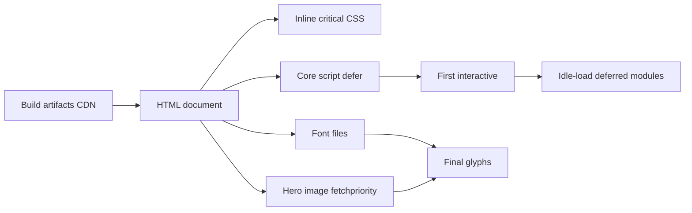

# Long Article Stress Test: Static Site Performance Handbook

This is a deliberately long acceptance sample. It contains a dozen level-2 sections, several level-3 subsections, repeated images, wide tables, deeply nested lists and plenty of code blocks — to exercise **TOC scroll highlighting**, the **reading progress bar**, **image lazy loading**, **anchor jumps** and long-page scrolling performance.

Jump straight to the point: [Performance Budget Checklist](#performance-budget-checklist). Related reading: [Code Blocks Showcase](/en/code-showcase/), [Diagrams & Math](/en/diagrams-math/), [Site Building Notes (2)](/en/series-2/).

## Why Static Sites Still Need Optimization

Static sites move rendering cost into build time, but that does not mean the browser gets everything for free. The first view still has to parse HTML, load fonts, decode images and execute scripts; if any one of those blocks, the user sees a blank screen or a jolt.

> Performance is not a single metric; it is the entire wait between clicking a link and being able to read.

Three numbers usually capture the experience: **LCP** (Largest Contentful Paint), **INP** (Interaction to Next Paint) and **CLS** (Cumulative Layout Shift). Every section below says which one it affects.

## Performance Budget Checklist

Write the budget down first, then make the implementation match. Budgets rarely blow up at one point — they accumulate from a hundred "just a little more" decisions.

| Metric | Budget | Where measured | First action when exceeded |
| --- | --- | --- | --- |
| LCP | 2.5 s | hero image / heading | check font blocking and image weight |
| INP | 200 ms | interaction response | split long tasks, drop sync scripts |
| CLS | 0.1 | layout shifts | reserve sizes for images and ads |
| TTFB | 500 ms | edge node | improve cache hit rate |
| Above-the-fold JS | 150 KB | compressed transfer | remove unused modules |
| Above-the-fold CSS | 60 KB | inline + external | split critical CSS |
| Font files | 2 | above-the-fold weights | subset or fall back to system fonts |
| Image requests | 6 | in the first viewport | lazy-load the rest |

The budget above is not extreme; it simply gives every change a red line to compare against. Optimizations beyond the line should first ask whether the gain is worth the complexity.

## Above-The-Fold Path

Everything on the critical path competes for the same network and main thread. The order is: delete first, lazy-load second, parallelize last.

### Critical CSS

Inline the styles required for the first view, and load the rest asynchronously. The win is removing a round trip for CSS; the cost is a larger HTML document, so keep it within tens of KB.

```html
<style>/* critical: nav, headings, skeleton layout */</style>
<link rel="stylesheet" href="/assets/site.css" media="print" onload="this.media='all'">
```

### Font Loading

How much fonts block text rendering depends on `font-display`. `swap` shows fallback text first, then swaps. For CJK sites the bigger lever is **limiting the number of weights** — every weight is a separate request.

```css
@font-face {
  font-family: "Sora";
  src: url("/assets/vendor/fonts/sora.woff2") format("woff2");
  font-display: swap;
  font-weight: 400 800;
}
```

### Hero Image

The hero image should carry `fetchpriority="high"`, and its aspect ratio must be declared in HTML to avoid layout shift. Everything else lazy-loads.


## Deep Dive: The Image Pipeline

Images are usually the heaviest resource on a page. The pipeline solves three things: **generate the right sizes**, **offer modern formats**, **let the browser pick**.

### Variant Generation

The build generates WebP/AVIF variants and multiple widths per image, then emits `<picture>` so the browser chooses:

```html
<picture>
  <source srcset="/media/photo-640.webp 640w, /media/photo-1280.webp 1280w" type="image/webp" sizes="(max-width: 640px) 640px, 1280px">
  
</picture>
```

### Lazy Loading and Decoding

Images outside the viewport use `loading="lazy"`; decoding uses `decoding="async"` to keep decode off the critical path. Careful: lazy loading should apply only below the fold, otherwise it slows down LCP.

```js
const io = new IntersectionObserver((entries) => {
  for (const e of entries) {
    if (!e.isIntersecting) continue;
    const img = e.target;
    img.src = img.dataset.src;
    io.unobserve(img);
  }
}, { rootMargin: "600px 0px" });
```


## Script Loading Strategy

The core rule of the script budget: **never execute non-essential logic on the first view**. After modularization, secondary features load on demand.

```js
// Only the core module on the critical path
import { initCore } from "../core/main.js";
initCore();

// Everything else waits for idle time
requestIdleCallback(() => import("../domains/diagrams.js"));
```

Loading strategy comparison:

| Strategy | Good for | Avoid when |
| --- | --- | --- |
| Inline | tiny bootstrap code | large logic |
| Static import | first-view modules | low-frequency features |
| Dynamic import | diagrams, search, stats | critical path |
| defer / async | third-party scripts | order-dependent scripts |

## Caching and Invalidation

Caching makes the second visit almost instant; invalidation decides whether users ever see stale content. The balance point is the fingerprint in the filename.

| Resource | Cache policy | Invalidation |
| --- | --- | --- |
| HTML | `no-cache` | negotiate on every request |
| Fingerprinted JS/CSS | `max-age=31536000, immutable` | change the filename |
| Images and fonts | `max-age=31536000` | change filename or version dir |
| Search index | `no-cache` | rebuilt on every build |


## Rendering Path Sketch

The diagram below shows the critical path from build artifacts to the user's screen; every hop can have its own speed bump.



## A Small Algorithmic Note

Once page counts grow, list rendering and sorting show up in profiles. Take the pagination window: rebuilding every page button on each interaction is linear, and it runs on every click. A calmer approach **computes only the visible window**:

$$
W(i) = \begin{cases}
1, & i = 1 \ \text{or}\ i = N \\
\{1, \dots, m\}, & i < k \\
\{i-k, \dots, i+k\}, & k \le i \le N-k \\
\{N-m, \dots, N\}, & i > N-k
\end{cases}
$$

where $N$ is the total page count, $k$ the window radius and $m = 2k + 1$. This drops each interaction from $O(N)$ to $O(k)$; for a 100k-article archive it is the difference between milliseconds and seconds.

The same holds for sorting: never re-sort inside the render function; memoize the sorted array.

## Long List Stress

The nested list below is intentionally long — it exercises anchor jumps and scrolling in a very tall document.

1. Build-time optimization
   1. Asset fingerprints and cache headers
   2. Image variants and format negotiation
   3. Critical CSS extraction
   4. Unused CSS pruning
   5. HTML minification and attribute minimization
2. Transfer-time optimization
   1. Brotli and Gzip negotiation
   2. HTTP/2 or HTTP/3 multiplexing
   3. Edge caching and warm-up
   4. Preconnect and DNS prefetch
   5. Resource hints (preload / prefetch / preconnect)
3. Render-time optimization
   1. Inline critical CSS
   2. Font subsetting and `font-display`
   3. Image dimension placeholders
   4. Long-task splitting
   5. Event delegation and passive listeners
4. Runtime optimization
   1. Idle-load deferred modules
   2. Segmented search index
   3. On-demand diagram initialization
   4. Pause animations on `visibilitychange`
   5. Memory reclamation and object pools
5. Monitoring and regression
   1. Build size reports
   2. Lighthouse baselines
   3. Field data sampling
   4. Regression alert thresholds
   5. Pre-release performance gates

## Wide Table Stress

Large data tables are inherently cramped on small screens; horizontal scroll is the default, but header readability needs separate care.

| Module | Input | Output | Time (ms) | Peak memory | Notes |
| --- | --- | --- | --- | --- | --- |
| Content scan | articles/ | article objects | 120 | 48 MB | incremental cache |
| Markdown | article body | HTML | 260 | 96 MB | includes highlighting |
| Media pipeline | original images | variant set | 1800 | 320 MB | slow on first build |
| Page render | templates + data | HTML files | 340 | 64 MB | concurrent writes |
| Search index | full text | segmented JSON | 90 | 32 MB | < 200 KB after gzip |
| RSS/Feed | article digests | XML/JSON | 30 | 8 MB | none |
| Security files | config | _headers | 5 | 2 MB | whitelist validation |
| Compression | all artifacts | compressed files | 420 | 128 MB | Brotli level 5 |
| Report | statistics | report.json | 15 | 4 MB | consumed by CI |

## Code Block Stress

Several consecutive blocks check number alignment, language pills and copy button stability.

```bash
node scripts/build.js --serve --port 3224
curl -s -o /dev/null -w "%{http_code} %{time_total}s\n" http://127.0.0.1:3224/en/
```

```js
function debounce(fn, wait = 120) {
  let timer = null;
  return function (...args) {
    clearTimeout(timer);
    timer = setTimeout(() => fn.apply(this, args), wait);
  };
}
const onResize = debounce(() => console.log("viewport", innerWidth));
addEventListener("resize", onResize, { passive: true });
```

```diff
- addEventListener("scroll", onScroll);
+ addEventListener("scroll", onScroll, { passive: true });
- requestAnimationFrame(heavyLayout);
+ queueMicrotask(measureAfterPaint);
```

```python
import time

def measure(fn, rounds=5):
    best = float("inf")
    for _ in range(rounds):
        t0 = time.perf_counter()
        fn()
        best = min(best, time.perf_counter() - t0)
    return best
```

## Quotes and Notes

> Optimization was never about maximizing every number; it is about spending the budget where users notice most.

> One reproducible regression test beats ten "it feels faster" hunches.

A footnote in passing: the budgets echo the common guidance of $LCP \le 2.5s$ and $INP \le 200ms$; more formulas live in [Diagrams & Math](/en/diagrams-math/).

## Checklist

- [x] TOC scroll highlight covers every level-2 heading
- [x] Reading progress grows linearly with scroll
- [x] All images lazy-load with dimension placeholders
- [x] Code line numbers and terminal labels are correct
- [x] Back-to-top appears after scrolling
- [x] Favorite, share and reading-mode buttons work
- [ ] Run through it once more on your own device


## Closing

The value of a long stress article is not its word count; it is exposing problems that rarely trigger otherwise: misaligned scroll highlights, lazy-load boundaries, anchor offsets, back-to-top jitter, media decode hiccups. Run it after every big change and treat regression as a routine check-up.

Related reading: [Welcome & Site Map](/en/hello-world/) | [Code Blocks Showcase](/en/code-showcase/) | [Media Gallery & Image Pipeline](/en/gallery-media/) | [Site Building Notes (3)](/en/series-3/)
