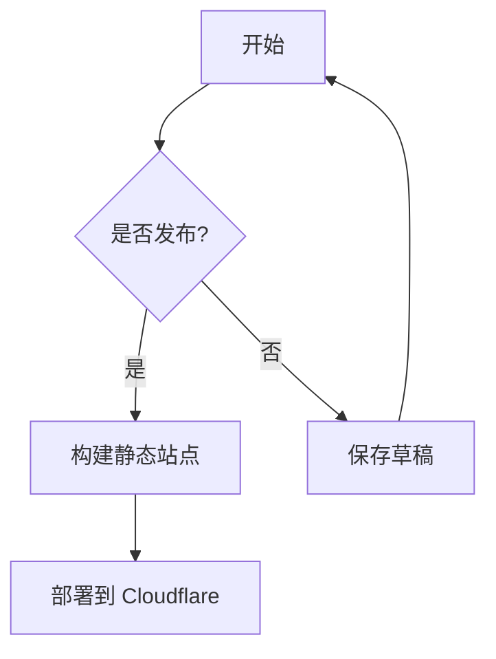
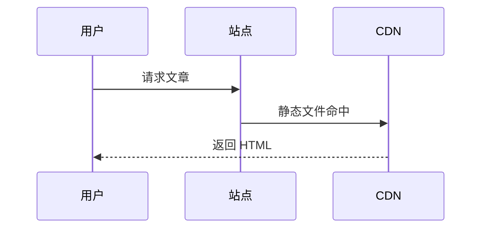

# S-ynapse 全功能测试

本文覆盖 S-ynapse 博客系统的 80 余项功能验证，用于构建前后一键验收。包含基础渲染、安全机制、阅读体验、内容体系、批量功能与界面定制。

## 文本样式

**粗体** *斜体* ~~删除线~~ ***粗斜体*** `行内代码`

上标 X^2^ 和下标 H~2~O（marked 扩展支持，前者渲染为上标，后者渲染为下标）

## 数学公式

行内公式：质能方程 $E = mc^2$，欧拉恒等式 $e^{i\pi} + 1 = 0$。

块级公式：

$$
\int_{-\infty}^{\infty} e^{-x^2} dx = \sqrt{\pi}
$$

$$
\nabla \cdot \vec{E} = \frac{\rho}{\varepsilon_0}
$$

## Mermaid 图表





## 链接类型

- 站内链接：[关于](/about/)
- 白名单域名（无弹窗）：<https://github.com/stop666two/S-ynapse>
- 白名单 CDN（无弹窗）：<https://cdn.jsdelivr.net/npm/prismjs@1/prism.min.js>
- 外部链接（弹窗警告）：<https://random-external-link.com/page>
- 危险链接（弹窗警告）：<https://malware-test.example.com/steal>
- 邮箱链接：<mailto:admin@example.com>
- 锚点链接：[跳转到表格](#表格)

## 双向链接（Wiki Links）

- 链接到现有文章标题：[[S-ynapse 全功能测试]]
- 链接到 slug：[[hello-world]]
- 链接自定义显示文本：[[hello-world|全功能测试文章]]
- 链接到不存在目标：[[不存在的内容]]
- 链接外部网址：[[https://example.com/wiki-link]]

## 系列文章

本文章属于系列测试，系列导航面板应出现在 prev/next 导航上方，显示系列名称、进度与上一集/下一集。

## 图片


点击任意正文图片应打开灯箱，支持左右箭头、ESC 关闭与移动端滑动。

## 标题层级

### 三级标题（过渡层级）

#### 四级标题（带锚点链接）
##### 五级标题（无锚点链接）
###### 六级标题（无锚点链接）

## 引用嵌套

> 第一层引用
>
> > 第二层嵌套
> >
> > > 第三层嵌套
>
> 回到第一层

## 列表混合

1. 有序第一项
   - 无序嵌套
   - 无序嵌套
     1. 再次有序
     2. 再次有序
2. 有序第二项
   - [x] 已完成任务
   - [ ] 未完成任务

## 定义列表

<dl>
  <dt>S-ynapse</dt>
  <dd>静态博客生成器，基于 Cloudflare 生态</dd>
  <dt>Markdown</dt>
  <dd>轻量级标记语言，纯文本格式</dd>
</dl>

## 任务列表

- [x] Markdown 渲染
- [x] 代码块高亮与复制
- [x] 外部链接警告弹窗
- [x] 暗黑模式切换
- [x] 灯箱预览
- [x] 阅读进度条点击跳转
- [ ] 评论系统接入
- [ ] PWA 离线支持

## 代码块

### JavaScript

```javascript
function fibonacci(n) {
  if (n <= 1) return n;
  return fibonacci(n - 1) + fibonacci(n - 2);
}

for (let i = 0; i < 10; i++) {
  console.log('fib(' + i + ') = ' + fibonacci(i));
}

const doubled = [1, 2, 3, 4, 5].map(x => x * 2);
```

### TypeScript

```typescript
interface BlogPost {
  title: string;
  slug: string;
  tags: string[];
  draft: boolean;
}

function createSlug(title: string): string {
  return title.toLowerCase().replace(/\s+/g, '-');
}
```

### Python

```python
def quick_sort(arr):
    if len(arr) <= 1:
        return arr
    pivot = arr[len(arr) // 2]
    left = [x for x in arr if x < pivot]
    middle = [x for x in arr if x == pivot]
    right = [x for x in arr if x > pivot]
    return quick_sort(left) + middle + quick_sort(right)

print(quick_sort([3, 6, 8, 10, 1, 2, 1]))
```

### Bash

```bash
#!/bin/bash
npm ci
npm run build
npx wrangler pages deploy dist --project-name=s-ynapse
```

### CSS

```css
:root {
  --color-primary: #2d3748;
  --color-secondary: #4a90d9;
  --container-width: 1140px;
}

@media (max-width: 768px) {
  .sidebar { display: none; }
}
```

### Diff

```diff
- console.log('debug');
+ logger.info('structured log');
```

### YAML

```yaml
site:
  title: S-ynapse
  url: https://synapse.dev
  language: zh-CN
build:
  minifyHTML: true
  minifyCSS: true
  enableCacheBusting: true
```

### SQL

```sql
SELECT a.title, a.date, t.name AS tag
FROM articles a
LEFT JOIN article_tags t ON a.id = t.article_id
WHERE a.draft = 0
ORDER BY a.date DESC;
```

### 无语言标记

```
This is a plain text block.
No language tag appears in the corner.
Copy button should still work.
```

### 引用内代码

> 在终端中执行：
>
> ```bash
> npm run dev
> ```
>
> 然后打开 <http://localhost:3000> 预览。

## 表格

### 标准表

| 功能 | 状态 | 优先级 | 技术栈 |
|------|------|--------|--------|
| Markdown 渲染 | ✅ 已完成 | P0 | marked 12 |
| 代码高亮 | ✅ 已完成 | P0 | Prism.js |
| 外部链接警告 | ✅ 已完成 | P0 | 白名单机制 |
| 暗黑模式 | ✅ 已完成 | P1 | CSS 变量 |
| PWA 支持 | ✅ 已完成 | P2 | Manifest |
| RSS Feed | ✅ 已完成 | P1 | feed |
| JSON Feed | ✅ 已完成 | P1 | feed |
| 搜索功能 | ✅ 已完成 | P0 | 全文搜索 |
| 灯箱预览 | ✅ 已完成 | P1 | 原生 JS |
| 双链系统 | ✅ 已完成 | P1 | Wiki Links |

### 对齐

| 左对齐 | 居中对齐 | 右对齐 |
|:-------|:--------:|-------:|
| 左 | 中 | 右 |
| 靠左 | 居中 | 靠右 |

### 单元格格式化

| 类型 | 示例 |
|------|------|
| 粗体 | **粗体文字** |
| 斜体 | *斜体文字* |
| 代码 | `inline code` |
| 链接 | [关于](/about/) |
| 上标 | X^2^ |
| 下标 | H~2~O |

## 安全机制

CSP 策略禁止以下行为：

- `<script>alert('XSS')</script>` — 被 CSP 阻止
- `<iframe src="https://evil.com"></iframe>` — 被 frame-src 阻止
- `` — 被 CSP 阻止

外部链接弹窗：

- <https://phishing-test.example.net/login>
- <https://unknown-site.org/download/malware.exe>

白名单验证（不应弹窗）：

- <https://github.com/stop666two>
- <https://stackoverflow.com/questions/ask>
- <https://developer.mozilla.org/en-US/docs/Web>

## 特殊字符

### HTML 实体

&amp; &lt; &gt; &quot; &#39; &copy; &reg; &trade;

### 中英混排

这是一段 Chinese 和 English 混排的文字，包含 U.S.A. 缩写、iPhone 14、Wi-Fi 6 和 WebP 格式。

无空格场景（自动插入细空格）：你好World 版本3 测试ABC

### 超长链接换行

<https://this-is-a-very-long-url-that-should-break-properly-and-not-overflow-the-container.example.com/very/long/path?with=many&query=parameters&and=more>

### 转义字符表

| 字符 | 转义前 | 转义后 |
|------|--------|--------|
| 星号 | \*not italic\* | *not italic* |
| 反引号 | \`not code\` | `not code` |
| 方括号 | \[not link\] | [not link] |

### 空内容边界

空表格单元格：

| 左 | 中 | 右 |
|---|---|---|
| 有内容 | | 有内容 |

## 交互功能

搜索关键词：**S-ynapse**、**突触**、**静态博客**、**Cloudflare**、**WebP**、**CSP**、**Markdown**、**灯箱**、**系列**。

键盘快捷键：

| 快捷键 | 功能 |
|--------|------|
| / | 打开搜索 |
| Ctrl+K | 打开搜索 |
| d | 切换暗色/亮色主题 |
| j / k | 文章详情页上一篇/下一篇 |
| ? | 显示快捷键帮助 |
| Esc | 关闭搜索、弹窗、抽屉或灯箱 |

## 界面定制

以下 UI 大功能通过 features.json5 与 theme.json 配置，全部支持开/关：

- 主题预设：6 套（经典蓝/极夜黑/森林绿/樱花粉/编辑部灰/赛博紫），亮暗双色联动，presetOverrides 微调
- 布局密度：compact / balanced / airy 三档（列表列数、容器宽度、间距、侧栏宽度）
- 背景特效：plain / gradient / grid / dots / particles 五模式（粒子可调数量/速度/连线/自动移动端关闭）
- 毛玻璃导航：header 背景模糊（blur/透明度随明暗主题）
- Hero 区块：首页列表上方，标题+副题+搜索+CTA+热门标签（可独立开关）
- 设计档位：圆角/阴影/边框三级（sharp~lg、flat~strong、none~visible）
- 字体系统：Inter/Noto Sans/Noto Serif/System/Custom 五档，字号比例与数字等宽开关
- 头像组件：author badge（圆形/圆角/方形+描边色）

## 代码块增强

- 窗口栏（macOS 风格）：开 windowBar 时显示圆点+文件名+语言+操作按钮（复制/下载融入栏内）
- 悬浮模式：关 windowBar 时复制/下载为悬浮图标按钮（悬停有 title 提示）
- 下载：降级文件名 = 站点名-文章题-时间戳.扩展名
- 长代码折叠：超过 collapseLineThreshold 自动收起，可展开/收合
- 代码窗口主题与行内高亮线随 codeHighlight 配置

## 阅读体验

- 图片懒加载：本文图片使用 loading="lazy" 属性
- 阅读进度条：顶部渐变进度条，点击可跳转，带跟随圆点，点击显示百分比
- 返回顶部：右下角箭头按钮（滚动后显示，盲区锚点）- 可隐藏
- 代码复制：悬停代码块右上角出现复制按钮（含下载/折叠）
- 文章目录：左侧自动显示当前文章标题结构，移动端为抽屉式 M-TOC
- 阅读设置：post 页右下角齿轮可调字号/行高/宽度，localStorage 持久化（带重置）
- 朗读（TTS）：post 页工具栏朗读按钮，使用 speechSynthesis，可配置语速/开关
- 字数统计：首页/分类/标签卡片与归档统计卡显示中文字数
- 内容限宽：正文区最大 1600px 居中，满足长行阅读
- 滚动动效：卡片/标题/图片进入视口渐入（reveal，可调时长/阈值/交错上限）
- 搜索引擎：卡片式大空间弹窗（Ctrl+K），Markdown 高亮、计数提示、导航自动隐藏

## 分享与打赏（本站样例）

正文底部工具栏包含：微博、QQ、微信、X、Facebook、邮件、复制链接 7 个分享入口。

打赏：本项目 reward 默认关闭（开放在 site.json 配置，支持支付宝/微信图片二维码或链接）。

## 长文本压力测试

这是一段超长文本，用于测试阅读进度条、阅读时间估算和排版引擎在长段落下的渲染性能。S-ynapse 是基于 Cloudflare 生态构建的静态博客系统，采用全配置驱动的设计哲学。系统加载 10 个配置模块（6 个 JSON5 主配置 + features 功能总控 + content-policy 内容策略 + tag-aliases 标签别名 + friends 友链 + ui-strings 界面文案），合计超过 560 个可用配置项，覆盖站点元信息、主题预设与设计档位、导航菜单、侧边栏组件、页脚布局、安全策略、功能总控（38+ 模块开/关/微调）、黑白名单、别名归一、友情链接与全站文案。构建管线包含多个步骤：加载配置与合并默认值、设置输出目录并清理先前产物、复制静态资源文件夹、执行内容策略（白名单过滤视频/素材/图片目录）、使用 sharp 库进行媒体优化（生成 WebP/AVIF 和多尺寸响应式图片）、解析文章 Frontmatter 并转换为 HTML、处理自定义页面、生成首页分页与文章详情页、生成归档（含年历热力图与统计卡）与标签云页面、生成图库页、生成 RSS/JSON Feed 与站点地图、生成搜索索引、写入安全头与 robots.txt、对 HTML/CSS/JS 进行压缩、执行缓存破坏。每一步均有独立 enabled 开关，关闭后页面零残留。系统在安全方面同样不遗余力：CSP 内容安全策略控制所有资源加载来源、外部链接白名单和黑名单双轨控制弹窗行为、速率限制防止暴力请求、X-Frame-Options 阻止点击劫持、HSTS 强制 HTTPS 连接、内容白名单双链系统。前端交互方面提供暗黑模式（支持跟随系统偏好与手动切换，无闪烁）、客户端全文搜索（/ 或 Ctrl+K 快捷键唤醒）、代码复制按钮、阅读进度条（可点击）、灯箱（支持键盘与手势）、返回顶部按钮、标题锚点链接、外部链接安全弹窗、社交联系方式弹窗一键复制、上下标扩展、KaTeX 数学公式、Mermaid 图表、Wiki 双链、系列文章导航、分享按钮、打赏弹窗与侧栏系列/统计 widget。性能方面采用全静态 HTML 输出加全球 CDN 加速、关键 CSS 内联降低首屏渲染阻塞、JavaScript 异步加载延迟执行、图片懒加载减少初始带宽消耗。部署支持 Cloudflare Pages 纯静态托管、Cloudflare Workers 动态安全层、GitHub Actions CI/CD 自动部署。

## 回归验证清单

- [x] 所有代码块显示语言标签
- [x] 所有代码块显示复制按钮（windowBar 融入/悬浮）
- [x] 代码块下载按钮与折叠
- [x] 表格正确渲染
- [x] 引用样式正常（左边框加背景色）
- [x] 外部链接 target="_blank" 加 rel="noopener noreferrer"
- [x] 站内链接无 target 和 rel
- [x] 标题锚点显示
- [x] 图片懒加载属性
- [x] 深色模式 CSS 变量切换
- [x] 搜索索引包含本文内容
- [x] RSS feed 包含本文全文
- [x] 阅读进度条显示且可点击跳转
- [x] 返回顶部按钮显示
- [x] 左侧目录显示
- [x] 外部链接白名单过滤
- [x] 关联文章区域显示
- [x] 社交联系方式弹窗
- [x] 灯箱打开/关闭/切换
- [x] 数学公式行内/块级渲染
- [x] Mermaid 图表渲染
- [x] 双向链接命中与文本保护
- [x] 系列导航面板与徽标
- [x] 标签别名归一（js → JavaScript）
- [x] 置顶文章排序与角标
- [x] 字数统计显示
- [x] 分页与归档热力图
- [x] 图库页与灯箱联动
- [x] 上下标扩展（X^2^ 与 H~2~O）
- [x] 分享按钮与复制提示
- [x] JSON Feed /feed.json 输出
- [x] 重定向规则 _redirects 生成
- [x] 维护模式 503
- [x] 导入 CLI（Hexo/Hugo/WordPress）
- [x] 内容策略（可执行文件 404）
- [x] AVIF 变体（配置开启时生成）
- [x] 主题预设 6 套切换 + 亮暗联动
- [x] 密度三档 + 列表列数
- [x] 背景五模式（含粒子连线）
- [x] 毛玻璃导航
- [x] 首页 Hero 区（标题/CTA/热门标签）
- [x] 无封面文章自动生成居中标题 OG 图
- [x] 界面文案 ui-strings 覆盖（如切换提示/分享文案）
- [x] 数字等宽/字号比例字体系统
