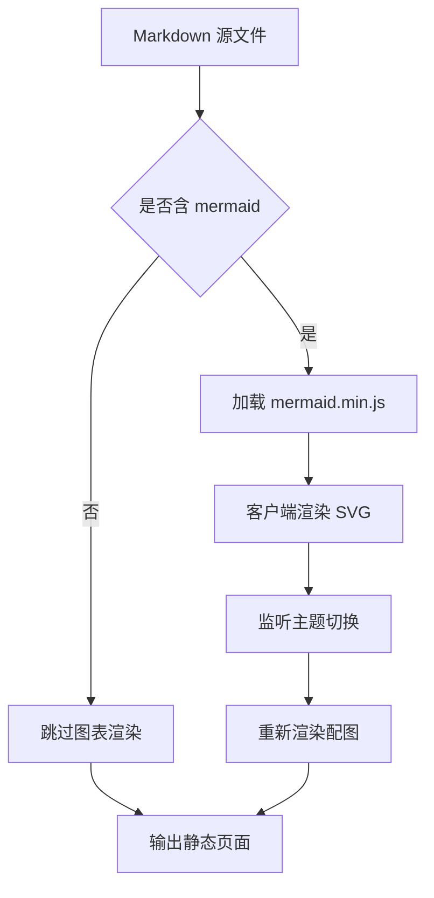
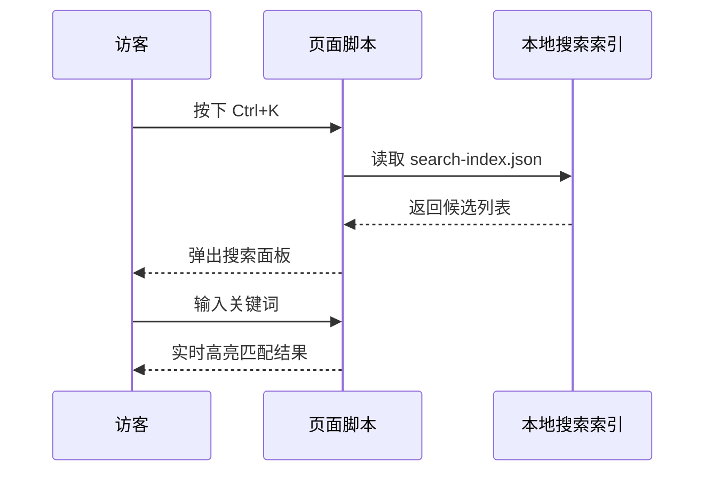
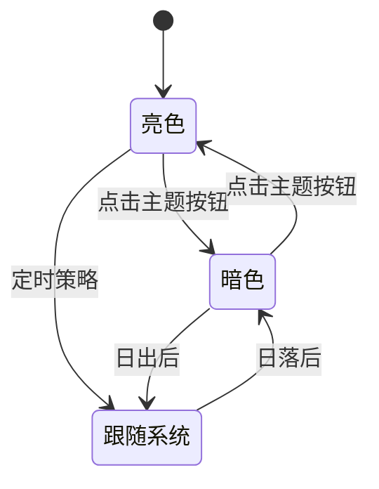
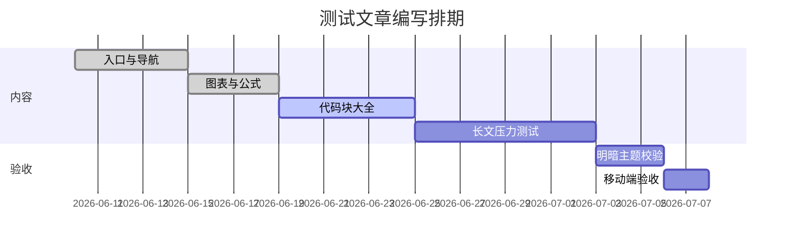
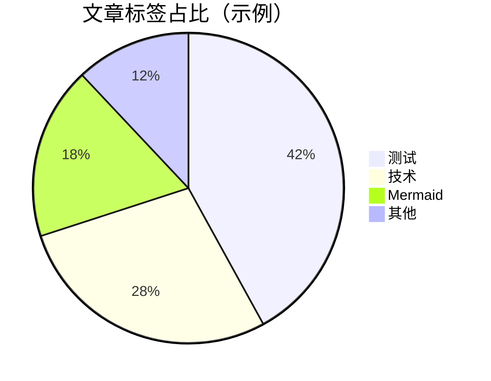

# 图表与数学公式

本文验证 **Mermaid 图表**与 **KaTeX 公式**在明暗两种主题下的渲染与重绘。切换右上角主题按钮，图表应自动以对应配色重绘。

## 流程图

## 时序图

## 状态图

## 甘特图

## 饼图

## 行内公式

质能方程 $E = mc^2$；欧拉恒等式 $e^{i\pi} + 1 = 0$；一元二次求根公式 $x_{1,2} = \frac{-b \pm \sqrt{b^2-4ac}}{2a}$。括号定界写法同样有效：\(a^2 + b^2 = c^2\)。

## 块级公式

$$
\frac{\partial}{\partial t} \Psi = \frac{i\hbar}{2m} \nabla^2 \Psi
$$

$$
\sum_{n=1}^{\infty} \frac{1}{n^2} = \frac{\pi^2}{6}, \qquad \lim_{x \to 0} \frac{\sin x}{x} = 1
$$

方括号定界：

\[
f(x) = \int_{-\infty}^{\infty} \hat{f}(\xi)\, e^{2\pi i \xi x} \, d\xi
\]

## 组合矩阵

$$
\begin{pmatrix} a & b \\ c & d \end{pmatrix}
\begin{pmatrix} x \\ y \end{pmatrix}
=
\begin{pmatrix} ax + by \\ cx + dy \end{pmatrix}
$$

公式与图表的联调说明见 [欢迎与全站导航](/zh/hello-world/)；代码渲染见 [代码块大全](/zh/code-showcase/)。
