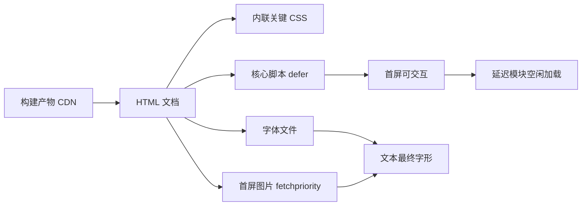

# 长文压力测试：静态站点性能优化手册

这是一篇刻意写长的压力验收样本。它包含十余个二级章节、若干三级小节、重复出现的图片、宽表格、深层嵌套列表与大量代码块，用来检验**目录滚动高亮**、**阅读进度条**、**图片懒加载**、**锚点跳转**以及长页面的滚动性能。

直接跳到重点：[性能预算清单](#性能预算清单)。相关阅读：[代码块大全](/zh/code-showcase/)、[图表与数学公式](/zh/diagrams-math/)、[建站手记（二）](/zh/series-2/)。

## 为什么静态站点仍然需要优化

静态站点把渲染成本转移到了构建期，但这不代表浏览器可以免费拿到一切。首屏依然要解析 HTML、加载字体、解码图片、执行脚本；只要其中任意一环阻塞，用户看到的就是白屏或跳动。

> 性能不是某一项指标，而是用户从点击链接到「可以开始阅读」之间的全部等待。

衡量静态站点的体验，通常盯住三个数字：**LCP**（最大内容绘制）、**INP**（交互到下一次绘制）、**CLS**（累计布局偏移）。本手册的每个小节都会说明它影响其中哪一个。

## 性能预算清单

先把预算写在纸面上，再让实现对齐；预算失控通常不是单点造成的，而是每一个「只多一点点」的累加。

| 指标 | 预算上限 | 测量位置 | 超限时的第一动作 |
| --- | --- | --- | --- |
| LCP | 2.5 s | 首屏主图 / 标题 | 检查字体阻塞与图片体积 |
| INP | 200 ms | 交互响应 | 拆分长任务、减少同步脚本 |
| CLS | 0.1 | 布局偏移 | 为图片与广告预留尺寸 |
| TTFB | 500 ms | 边缘节点 | 提升缓存命中率 |
| 首屏 JS | 150 KB | 传输压缩后 | 删除未使用的模块 |
| 首屏 CSS | 60 KB | 内联 + 外链合计 | 拆分关键 CSS |
| 字体文件 | 2 个 | 首屏字重 | 子集化或系统回退 |
| 图片请求 | 6 张 | 首屏视口内 | 延迟加载视口外资源 |

以上预算并不追求极致，而是让每次改动都有一个可对照的红线。超出红线的优化，应当先问「收益是否值得复杂度」。

## 首屏路径优化

首屏路径上的一切都在竞争同一条网络与主线程。优化的顺序是：先删、再懒、最后并行。

### 关键 CSS

把首屏必需的样式内联进文档头，其余样式异步加载或延后应用。收益是消除 CSS 请求的往返延迟；代价是 HTML 体积增加，需要控制在几十 KB 以内。

```html
<style>/* 关键样式：导航、标题、骨架布局 */</style>
<link rel="stylesheet" href="/assets/site.css" media="print" onload="this.media='all'">
```

### 字体加载

字体阻塞文本渲染的程度取决于 `font-display`。`swap` 让文本先用回退字体显示，字体就绪后再替换；对中文站点更重要的是**控制字重数量**，每个字重都是一次独立请求。

```css
@font-face {
  font-family: "Sora";
  src: url("/assets/vendor/fonts/sora.woff2") format("woff2");
  font-display: swap;
  font-weight: 400 800;
}
```

### 首屏图片

首屏主图应当带 `fetchpriority="high"`，并确保宽高比在 HTML 中就已声明，避免布局偏移。其余图片全部延迟加载。


## 图片管线深入

图片通常是页面上最重的资源。管线要解决三件事：**生成正确的尺寸**、**提供现代格式**、**让浏览器按需取用**。

### 变体生成

构建期为每张图片生成 WebP/AVIF 变体与多个宽度档位，并用 `<picture>` 输出，把选择权交给浏览器：

```html
<picture>
  <source srcset="/media/photo-640.webp 640w, /media/photo-1280.webp 1280w" type="image/webp" sizes="(max-width: 640px) 640px, 1280px">
  
</picture>
```

### 懒加载与解码

视口外的图片使用 `loading="lazy"`；解码使用 `decoding="async"` 让解码离开主线程关键路径。注意：懒加载只应作用于首屏之外的图片，否则会拖慢 LCP。

```js
const io = new IntersectionObserver((entries) => {
  for (const e of entries) {
    if (!e.isIntersecting) continue;
    const img = e.target;
    img.src = img.dataset.src;
    io.unobserve(img);
  }
}, { rootMargin: "600px 0px" });
```


## 脚本加载策略

脚本预算的核心原则：**首屏不执行非必要逻辑**。模块化拆分后，按需动态加载次要功能。

```js
// 首屏只加载核心模块
import { initCore } from "../core/main.js";
initCore();

// 非首屏功能延迟到空闲时加载
requestIdleCallback(() => import("../domains/diagrams.js"));
```

加载策略对照：

| 策略 | 适用 | 不适用 |
| --- | --- | --- |
| 内联 | 极小的引导代码 | 大段逻辑 |
| 静态 import | 首屏必需模块 | 低频功能 |
| 动态 import | 图表、搜索、统计 | 关键路径 |
| defer / async | 第三方脚本 | 有顺序依赖的脚本 |

## 缓存与失效

缓存让第二次访问几乎瞬时；失效策略则决定用户会不会看到陈旧内容。两者的平衡点由文件名指纹（fingerprint）决定。

| 资源 | 缓存策略 | 失效方式 |
| --- | --- | --- |
| HTML | `no-cache` | 每次协商校验 |
| 带指纹的 JS/CSS | `max-age=31536000, immutable` | 改文件名 |
| 图片与字体 | `max-age=31536000` | 改文件名或版本目录 |
| 搜索索引 | `no-cache` | 构建时更新 |

> 让内容与文件名绑定：内容变，文件名就变；文件名不变，内容就别变。


## 渲染路径示意

下图给出从构建产物到用户屏幕的关键路径；注意每个环节都可能有独立的减速带。



## 数学与算法小注

页面规模增长后，列表渲染与排序会出现在性能剖析里。以分页窗口为例，如果用暴力遍历重新构建全部页码按钮，复杂度是线性的，但每次交互都会触发；更稳妥的是**只计算可见窗口**：

$$
W(i) = \begin{cases}
1, & i = 1 \ \text{或}\ i = N \\
\{1, \dots, m\}, & i < k \\
\{i-k, \dots, i+k\}, & k \le i \le N-k \\
\{N-m, \dots, N\}, & i > N-k
\end{cases}
$$

其中 $N$ 为总页数、$k$ 为窗口半径、$m = 2k + 1$。该策略把每次交互的计算量从 $O(N)$ 降到 $O(k)$；对 10 万篇文章的分页界面，这是毫秒与秒的差距。

列表项的排序同理：避免在渲染函数里重复排序，把排序结果放进 `useMemo` 或模块级缓存。

## 长列表压力

下面的嵌套列表刻意写长，用于检验长文档的锚点跳转与滚动性能。

1. 构建期优化
   1. 资源指纹与缓存头
   2. 图片变体与格式协商
   3. 关键 CSS 提取
   4. 未使用 CSS 清理
   5. HTML 压缩与属性最小化
2. 传输期优化
   1. Brotli 与 Gzip 协商
   2. HTTP/2 或 HTTP/3 多路复用
   3. 边缘缓存与预热
   4. 预连接与 DNS 预取
   5. 资源提示（preload / prefetch / preconnect）
3. 渲染期优化
   1. 关键 CSS 内联
   2. 字体子集化与 `font-display`
   3. 图片尺寸占位
   4. 长任务拆分
   5. 事件委托与被动监听
4. 运行时优化
   1. 空闲加载延迟模块
   2. 搜索索引分段
   3. 图表按需初始化
   4. 监听 `visibilitychange` 暂停动画
   5. 内存回收与对象池
5. 监控与回归
   1. 构建体积报告
   2. Lighthouse 基线
   3. 现场数据采样
   4. 回归告警阈值
   5. 发布前性能门禁

## 宽表格压力

大数据表在小屏幕上天然拥挤，横滚是默认策略，但表头的可读性需要单独处理。

| 模块 | 输入 | 输出 | 耗时（ms） | 峰值内存 | 备注 |
| --- | --- | --- | --- | --- | --- |
| 内容扫描 | articles/ | 文章对象 | 120 | 48 MB | 增量缓存 |
| Markdown | 文章正文 | HTML | 260 | 96 MB | 含高亮 |
| 媒体管线 | 原始图片 | 变体集 | 1800 | 320 MB | 首次构建慢 |
| 页面渲染 | 模板 + 数据 | HTML 文件 | 340 | 64 MB | 并发写入 |
| 搜索索引 | 全文 | 分段 JSON | 90 | 32 MB | gzip 后 < 200 KB |
| RSS/Feed | 文章摘要 | XML/JSON | 30 | 8 MB | 无 |
| 安全文件 | 配置 | _headers | 5 | 2 MB | 校验白名单 |
| 压缩 | 全部产物 | 压缩文件 | 420 | 128 MB | Brotli 级别 5 |
| 报告 | 统计 | report.json | 15 | 4 MB | 供 CI 使用 |

## 代码块压力

连续多个代码块用于检验行号对齐、语言标签与复制按钮的稳定性。

```bash
node scripts/build.js --serve --port 3224
curl -s -o /dev/null -w "%{http_code} %{time_total}s\n" http://127.0.0.1:3224/zh/
```

```js
function debounce(fn, wait = 120) {
  let timer = null;
  return function (...args) {
    clearTimeout(timer);
    timer = setTimeout(() => fn.apply(this, args), wait);
  };
}
const onResize = debounce(() => console.log("viewport", innerWidth));
addEventListener("resize", onResize, { passive: true });
```

```diff
- addEventListener("scroll", onScroll);
+ addEventListener("scroll", onScroll, { passive: true });
- requestAnimationFrame(heavyLayout);
+ queueMicrotask(measureAfterPaint);
```

```python
import time

def measure(fn, rounds=5):
    best = float("inf")
    for _ in range(rounds):
        t0 = time.perf_counter()
        fn()
        best = min(best, time.perf_counter() - t0)
    return best
```

## 引用与提示

> 优化从来不是把每个数字都做到最好，而是把预算花在用户感知最强的地方。

> 一次可复现的回归测试，胜过十次「感觉变快了」的直觉。

行内补充：性能预算参考了 $budget \le 2.5s$（LCP）与 $INP \le 200ms$ 的业界经验值；本文的更多公式见 [图表与数学公式](/zh/diagrams-math/)。

## 检查清单

- [x] TOC 滚动高亮覆盖全部二级标题
- [x] 阅读进度条随滚动线性增长
- [x] 图片全部懒加载且带尺寸占位
- [x] 代码块行号与终端标签正确
- [x] 返回顶部按钮在页面滚动后出现
- [x] 收藏、分享、阅读模式按钮可用
- [ ] 在你常用的设备上再过一遍


## 结语

长文压力测试的价值不在字数，而在于把「平时不常触发」的问题暴露出来：滚动高亮错位、懒加载边界、锚点偏移、返回顶部跳动、媒体解码抖动。建议每次大改后都跑一遍本文，把回归当作例行体检。

相关阅读：[欢迎与全站导航](/zh/hello-world/) ｜ [代码块大全](/zh/code-showcase/) ｜ [媒体画廊与图片管线](/zh/gallery-media/) ｜ [建站手记（三）](/zh/series-3/)
